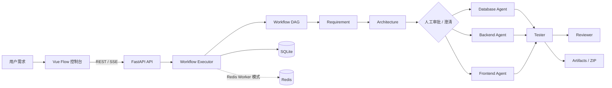

# Orbit / Agent Team

一个面向软件开发分析与交付的可视化多 Agent 协作平台。用户输入一条需求后，平台会按照可配置的 Workflow DAG 依次完成需求分析、架构设计、人工确认、数据库/后端/前端实现、测试和评审，并通过 Vue Flow 画布、SSE 事件流和成果物面板展示整个过程。

> 当前项目是一个可运行的编排平台 MVP，重点是验证多 Agent 协作、可恢复执行和交付门禁，不会直接修改用户的真实代码仓库。

## 目录

- [核心能力](#核心能力)
- [系统架构](#系统架构)
- [项目结构](#项目结构)
- [环境要求](#环境要求)
- [快速启动](#快速启动)
- [模型与运行时配置](#模型与运行时配置)
- [使用流程](#使用流程)
- [Workflow 与 Agent](#workflow-与-agent)
- [API 概览](#api-概览)
- [测试与验证](#测试与验证)
- [安全说明](#安全说明)
- [故障排查](#故障排查)

## 核心能力

- 声明式 YAML Workflow：支持 Agent、人工审批、需求澄清、失败策略、运行时预算和成果物生成模式。
- DAG 校验与调度：检查重复 ID、缺失依赖、自依赖和循环依赖；同一执行层可并发运行。
- 多 Provider 适配：支持 OpenAI-compatible 服务、千问、DeepSeek、GLM，以及本机已登录的 Codex CLI。
- 自适应路由：根据需求能力、项目类型和复杂度决定是否保留数据库、后端和前端分支。
- 运行时控制：Token 预算、思考强度、超时、指数退避重试、输出截断续写和局部修复。
- 人工介入：架构审批和高影响需求歧义可以暂停运行，用户确认后继续。
- 可恢复执行：Run、Step、事件、Artifact 和 LangGraph Checkpoint 持久化到 SQLite；Redis 模式支持独立 Worker、租约和故障接管。
- 成果物交付：识别带文件名的代码块，生成独立源码文件、在线预览和 ZIP 下载，并执行路径、构建、启动和合同校验。
- 可观测性：前端画布、节点 Inspector、Agent 日志、运行历史、SSE 实时事件和 Token 统计。
- 安全边界：密钥只在后端使用；生成页面在沙箱中预览；平台工作区会屏蔽 `.env`、`.git`、数据库和缓存文件。

## 系统架构



默认软件开发链路为：

```text
Requirement → Architecture → Approval → Database / Backend / Frontend → Tester → Reviewer
```

其中 Database、Backend 和 Frontend 是否运行，会根据原始需求和架构决策自动路由。明确的纯前端页面可以跳过后端；包含 CRUD、业务数据、登录、接口或持久化需求时会保留相应分支。

## 项目结构

```text
.
├── backend/
│   ├── agents/                    # AgentDefinition YAML
│   ├── app/
│   │   ├── api/                   # REST / SSE 接口
│   │   ├── agents/                # Agent Registry
│   │   ├── code_company/          # 合同、修复和交付编排能力
│   │   ├── llm/                   # Provider 抽象与实现
│   │   ├── repositories/          # SQLite 持久化
│   │   ├── runtime/               # Redis 协调与 Worker 支持
│   │   ├── services/              # Workflow、Artifact 服务
│   │   ├── skills/                # 动态 Skill 注册与解析
│   │   ├── workflow/              # DAG、Executor、校验、恢复
│   │   └── workflows/             # Workflow YAML
│   ├── scripts/                   # 回归测试脚本
│   ├── tests/                     # 后端测试
│   ├── .env.example               # 云端模型配置模板
│   ├── .env.runtime.example       # Redis Worker 配置模板
│   └── requirements.txt
├── frontend/
│   ├── src/App.vue                # 控制台页面
│   ├── src/style.css              # 页面样式
│   ├── package.json
│   └── vite.config.ts
├── docker-compose.redis.yml       # 本地 Redis 7
├── start-dev.ps1                  # Windows 启动逻辑
├── 启动开发环境.bat                # Windows 一键启动入口
├── .gitignore
└── README.md
```

运行时生成的数据库、日志、工作区、Checkpoint 和成果物位于 `backend/data/`，不会提交到 Git。

## 环境要求

- Windows PowerShell（项目提供 Windows 一键启动脚本）
- Python 3.10+，建议 Python 3.11+
- Node.js 18+ 和 npm
- Docker Desktop：仅 Redis Worker 模式需要；本地模式不依赖 Docker
- 可选：本机已登录的 Codex CLI，用于 `chatgpt_local` Provider

## 快速启动

### 1. 准备后端配置

在项目根目录执行：

```powershell
Copy-Item backend/.env.example backend/.env
Copy-Item backend/.env.runtime.example backend/.env.runtime
```

`backend/.env` 只保存在本机，用于配置模型 Provider 和 API Key。若使用 ChatGPT 本地登录模式，可以不填写云端 API Key。Redis 不可用时，一键启动脚本会自动降级到本地 SQLite 模式；必须使用 Redis 时可设置：

```powershell
$env:AGENT_TEAM_REDIS_REQUIRED = "1"
```

### 2. 安装依赖

```powershell
cd backend
python -m venv .venv
.\.venv\Scripts\Activate.ps1
python -m pip install -r requirements.txt

cd ..\frontend
npm install
cd ..
```

### 3. 一键启动（Windows）

```powershell
.\启动开发环境.bat
```

脚本会：

1. 检查并释放属于本项目的 `3456`、`2199` 旧进程；
2. 按配置启动 Redis（必要时尝试启动 Docker Desktop）；
3. 启动 FastAPI API、Redis Worker 和 Vite 前端；
4. 检查健康状态并打开浏览器。

访问：

- 控制台：<http://127.0.0.1:2199>
- 后端健康检查：<http://127.0.0.1:3456/api/health>
- 后端 OpenAPI：<http://127.0.0.1:3456/docs>

日志默认写入 `backend/data/logs/`。

### 4. 手动启动

不使用 Redis 时，在第一个终端启动 API：

```powershell
cd backend
.\.venv\Scripts\Activate.ps1
$env:AGENT_TEAM_EXECUTION_MODE = "local"
python -m uvicorn app.main:app --reload --host 127.0.0.1 --port 3456
```

在第二个终端启动前端：

```powershell
cd frontend
npm run dev -- --host 127.0.0.1 --port 2199
```

使用 Redis Worker 模式时，先启动 Redis，再分别运行 API 和 Worker：

```powershell
docker compose -f docker-compose.redis.yml up -d redis

cd backend
.\.venv\Scripts\Activate.ps1
$env:AGENT_TEAM_EXECUTION_MODE = "redis"
python -m uvicorn app.main:app --reload --host 127.0.0.1 --port 3456
python -m app.worker
```

## 模型与运行时配置

### Provider 配置

复制 `backend/.env.example` 后，根据实际 Provider 修改：

```dotenv
MODEL_PROVIDER=deepseek
MODEL_BASE_URL=https://api.deepseek.com
MODEL_NAME=deepseek-chat
MODEL_API_KEY=替换为真实密钥
```

常用 Provider：

| Provider | 说明 |
| --- | --- |
| `chatgpt_local` | 调用本机已登录的 Codex CLI，不需要 `MODEL_API_KEY` |
| `qwen` | 千问 OpenAI-compatible 接口 |
| `deepseek` | DeepSeek 接口 |
| `glm` | 智谱 GLM 接口 |
| `openai_compatible` | 自定义 OpenAI-compatible 服务 |

也可以打开控制台右上角的 `API settings`，填写 Provider、Base URL、Model 和 API Key。`Test connection` 会执行最小连通性测试；`Save configuration` 会更新本机的 `backend/.env`。API Key 不会返回给浏览器，也不会写入 SSE 事件或运行日志。

### Redis Worker 配置

Redis 配置位于 `backend/.env.runtime`，模板见 [backend/.env.runtime.example](backend/.env.runtime.example)。主要选项：

| 变量 | 默认值 | 作用 |
| --- | --- | --- |
| `AGENT_TEAM_EXECUTION_MODE` | `local` | `local` 使用 API 进程执行，`redis` 使用独立 Worker |
| `REDIS_URL` | `redis://127.0.0.1:6379/0` | Redis 连接地址 |
| `REDIS_WORKER_CONCURRENCY` | `4` | 单个 Worker 最大并发 Run 数 |
| `REDIS_LEASE_SECONDS` | `30` | Run 执行租约时间 |
| `REDIS_MAX_AUTO_RECOVERIES` | `5` | 自动恢复次数上限 |

SQLite 始终保存 Run、Step、Artifact、Checkpoint 和审计记录；Redis 只负责任务队列、实时事件、控制命令和 Worker 协调。

## 使用流程

1. 打开 <http://127.0.0.1:2199>。
2. 输入软件需求，选择 Workflow，点击 `Run workflow`。
3. 查看 Requirement 和 Architecture 节点输出；如果系统提出需求澄清，填写答案后继续。
4. Architecture 完成后，在 Inspector 中执行 `Approve architecture`，解锁后续分支。
5. 在画布节点中查看 Agent 日志、输入上下文、输出和验证结果。
6. Run 成功后，在“工作产物”区域预览源码、下载单文件或下载全部 ZIP。
7. 通过顶部“运行记录”查看历史 Run；失败 Run 可以重试失败节点及其下游节点。

前端会把当前 Run ID、Workflow ID 和事件游标保存在 `localStorage`。刷新或重新打开页面后，会先恢复 SQLite 快照，再从上次游标继续接收 SSE，避免重复展示事件。

## Workflow 与 Agent

默认 Workflow 位于 [backend/app/workflows/software-development.yaml](backend/app/workflows/software-development.yaml)。其他内置 Workflow 包括：

- `requirement-analysis.yaml`：只做需求分析；
- `backend-implementation.yaml`：只做后端方案；
- `frontend-implementation.yaml`：只做前端方案。

Workflow 使用声明式 YAML 描述依赖和上下文：

```yaml
name: software-development
concurrency: 3
inputs:
  requirement: ""

steps:
  - id: architecture
    agent: architect_agent
    depends_on: [requirement]
    task: |
      根据需求设计架构：
      {{requirement_doc}}
    output: architecture_doc

  - id: architecture_approval
    type: approval
    depends_on: [architecture]
```

Agent 定义位于 [backend/agents](backend/agents)，包含系统提示词、输出契约和角色信息。Workflow 支持：

- `defaults` / `runtime`：默认 `max_tokens`、重试次数和思考强度；
- `failure_policy`：失败后停止、跳过或继续；
- `generation_mode: single | artifacts | auto`：单次文本或按文件生成源码；
- `generation_mode: coding_loop`：受控 Plan → Act → Observe 循环，以 Agent 所有权合同限制文件创建/定点修改；
- `skills` / `skill_mode`：按角色注入后端 API、前端实现、成果物生成等 Skill；
- `validation`：构建、启动、浏览器验收和自动修复门禁；
- `meta.delivery_contract`：冻结实体、API、依赖、文件归属和交付证据。

Executor 通过 `RequirementSpec → DeliveryContract → ProjectBlueprint → ContractCompiler` 固定实现边界，再把角色合同分别交给 Database、Backend、Frontend 和 Tester，减少接口、字段和文件归属漂移。

代码公司中的 Database、Backend、Frontend 默认在各自隔离的 Workspace 里通过工具逐步创建和修改文件。模型每轮只提交一个工具动作；SQLite 记录模型轮次预算和文件动作意图，重启后核对已完成动作而不盲目重放。Tester 的确定性失败会按责任 Agent 路由到 Candidate Workspace：先执行目标 Gate，再执行完整回归；未推进或破坏既有通过项的候选会撤回。Agent 循环不执行任意 Shell，构建、启动、浏览器联调和交付判定仍由外层 Gate 负责。

## API 概览

后端 API 前缀为 `/api`，完整接口可在 `/docs` 查看。

| 方法 | 路径 | 说明 |
| --- | --- | --- |
| `GET` | `/api/health` | API、Redis 和 Worker 健康状态 |
| `GET` | `/api/provider/config` | 当前 Provider 元信息（不返回密钥） |
| `POST` | `/api/provider/test` | 测试模型连接 |
| `POST` | `/api/provider/config` | 保存本机 Provider 配置 |
| `GET` | `/api/workflows` | 列出 Workflow |
| `GET` | `/api/workflows/{id}/graph` | 获取画布节点和边 |
| `POST` | `/api/workflows/{id}/runs` | 创建 Run |
| `GET` | `/api/runs` | 查看 Run 历史 |
| `GET` | `/api/runs/{run_id}` | 查看 Run 详情和最近事件 |
| `GET` | `/api/runs/{run_id}/events` | SSE 运行事件流 |
| `POST` | `/api/runs/{run_id}/approval` | 处理人工审批 |
| `POST` | `/api/runs/{run_id}/clarification` | 提交需求澄清答案 |
| `POST` | `/api/runs/{run_id}/stop` | 停止 Run |
| `POST` | `/api/runs/{run_id}/retry` | 重试失败 Run |
| `GET` | `/api/runs/{run_id}/artifacts` | 查看成果物 |
| `GET` | `/api/runs/{run_id}/artifacts/archive` | 下载成果物 ZIP |

## 测试与验证

### 后端测试

```powershell
cd backend
.\.venv\Scripts\Activate.ps1
pytest -q
```

测试覆盖 DAG 校验、并发调度、Context 模板、Provider、审批/澄清、恢复、Redis 协调、Artifact、交付合同、自动修复和端到端执行链路。

### 前端生产构建

```powershell
cd frontend
npm run build
```

### 回归测试

回归脚本默认只输出执行计划，不调用真实模型：

```powershell
python backend/scripts/regression_suite.py --cases backend/scripts/regression_cases.json
```

只有显式增加 `--live` 才会使用当前 `.env` 的真实 Provider：

```powershell
python backend/scripts/regression_suite.py --live --auto-approve --cases backend/scripts/regression_cases.json --repeat 2 --timeout 1800
```

需要进行难度递增的 10 场景实测时，使用独立用例集；报告会在每个场景完成后同时更新 JSON 与 Markdown：

```powershell
python backend/scripts/regression_suite.py --live --auto-approve --cases backend/scripts/regression_cases_swe_10.json --timeout 1800
```

浏览器交付门禁需要 Playwright/Chromium：

```powershell
npm --prefix frontend exec -- playwright install chromium
```

缺少 Node、浏览器或外部服务时，验证器会报告 `blocked`，不会误报成功。

## 安全说明

- **不要提交真实密钥。** 真实配置只写入本地 `backend/.env`；模板中的 `MODEL_API_KEY` 必须替换为本机值。
- `.gitignore` 已忽略 `.env`、其他环境配置、凭据目录、JSON 凭据、私钥、证书和 Java keystore 等常见敏感文件；示例文件通过白名单保留。
- 即使密钥只短暂出现在 Git 历史中，也应立即在 Provider 控制台撤销并重新生成，单纯删除当前文件不足以清理历史。
- API Key 只由后端读取，不下发到 Vue 前端、SSE payload、Redis 任务消息或运行日志。
- 生成的 HTML 在沙箱文档中预览，默认禁止访问平台 Origin 和发起网络连接。
- 平台工作区会拒绝读取或写入 `.env`、`.git`、数据库、日志和私有缓存；子进程验证会清理敏感环境变量。
- 提交前建议执行：

```powershell
rtk git status --short
rtk git diff --check
rtk rg -n --hidden -g '!.git/**' -g '!backend/data/**' '(sk-[A-Za-z0-9]{20,}|AKIA[0-9A-Z]{16}|MODEL_API_KEY\s*=\s*[^R#\s])' .
```

## 故障排查

### 页面打不开

确认前端依赖已安装，并检查 `http://127.0.0.1:2199` 是否被其他程序占用。后端启动日志在 `backend/data/logs/backend-error.log`，前端日志在 `backend/data/logs/frontend-error.log`。

### `/api/health` 为 `degraded`

Redis 模式要求 Redis 可连接且至少有一个 Worker 注册。执行：

```powershell
docker compose -f docker-compose.redis.yml ps
```

然后确认 Worker 已运行：

```powershell
cd backend
python -m app.worker
```

如果只需要本地开发，可把 `AGENT_TEAM_EXECUTION_MODE` 改为 `local`，或删除本机的 `.env.runtime` 后重新启动。

### 模型连接失败

检查 `MODEL_PROVIDER`、`MODEL_BASE_URL`、`MODEL_NAME` 和 `MODEL_API_KEY` 是否匹配。GLM、DeepSeek、千问不能混用其他 Provider 的 Base URL；也可以先选择 `chatgpt_local`，确认本机 Codex CLI 登录状态。

### 启动后使用 Mock Provider

当没有配置有效 API Key、Key 仍为 `REPLACE_WITH_...`，或选择了不需要云端调用的本地模式时，平台会使用确定性的 Mock Provider，便于演示界面和编排链路。这不代表云端模型连接已经验证成功。

## 当前边界与后续方向

当前版本已经覆盖可恢复编排、Redis Worker、成果物生成、测试门禁和自动修复的主链路，但仍属于 MVP。后续可以继续完善：

1. Workflow 可视化编辑、拖拽连线和 YAML 保存；
2. 更细粒度的失败分支与人工回退策略；
3. Provider 版本、权限和 Token 成本报表；
4. 真实代码仓库修改、分支、沙箱和 Pull Request 交付。
